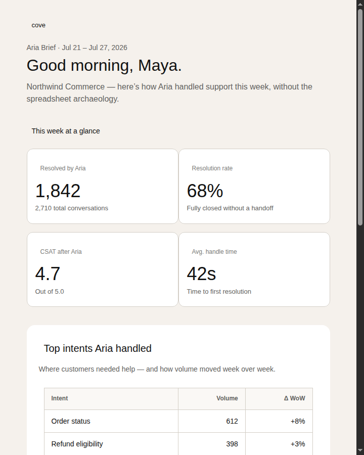
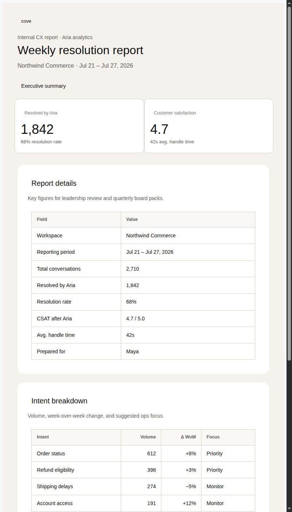
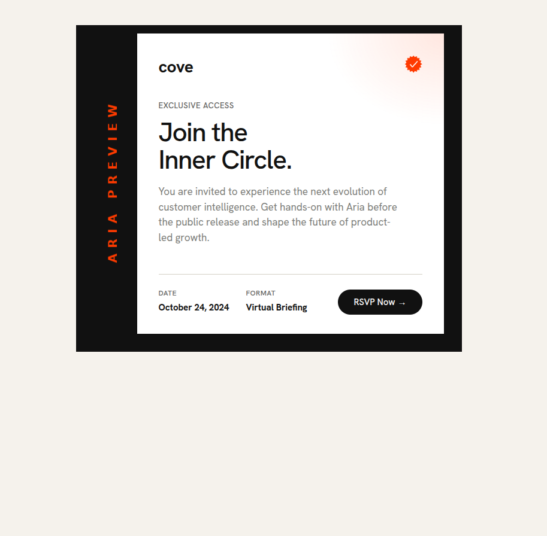
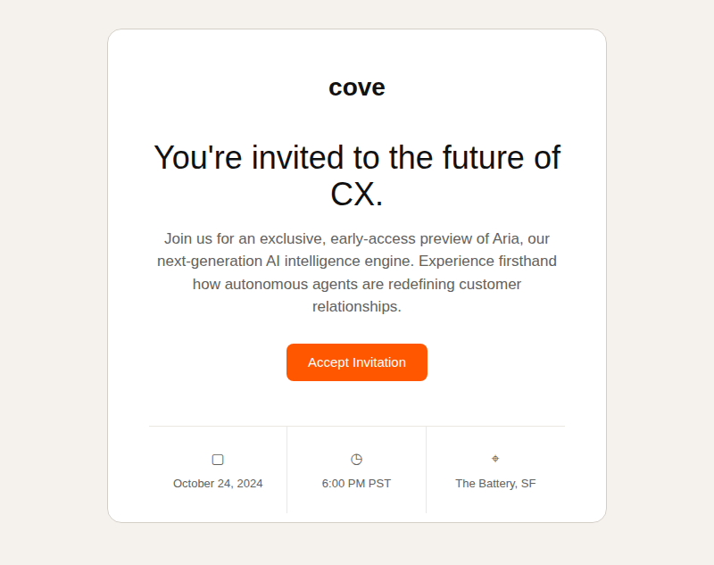
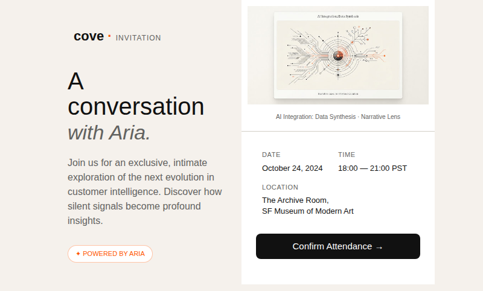
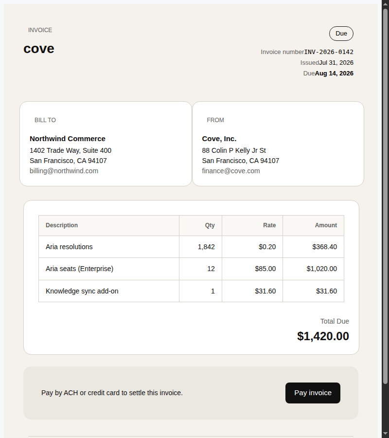
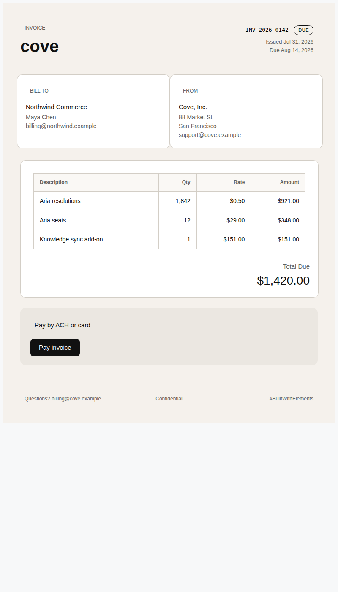
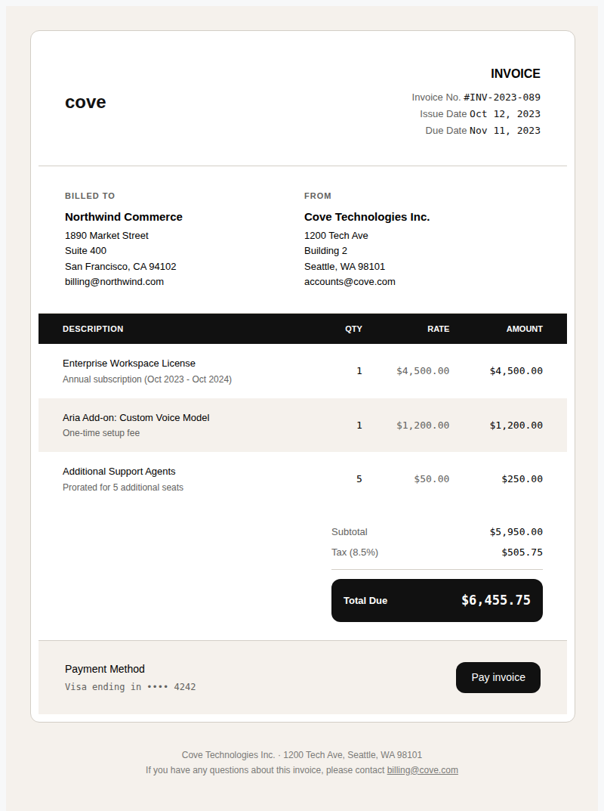
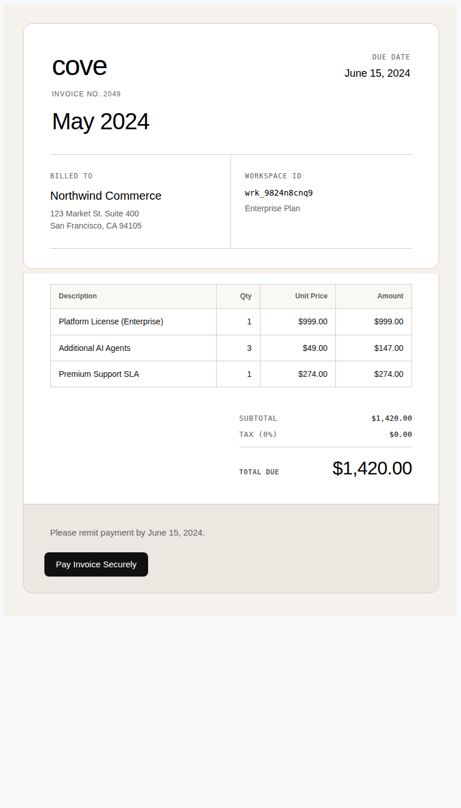

# Cove × Aria — Unlayer Elements suite

Original email and document templates built with [`@unlayer/react-elements`](https://github.com/unlayer/elements).

`#BuiltWithElements` · [Build with Elements Challenge](https://unlayer.com/elements)

**Cove** and **Aria** are fictional product names for this demo. Not affiliated with any third-party brand.

---

## What’s included

Nine production templates — invite emails, usage invoices, a weekly AI support digest, and a printable ops report — all authored as React with Elements and rendered to email-safe HTML, plain text, and design JSON.

| Template | Mode | Source |
| --- | --- | --- |
| Aria Brief digest | Email | `src/templates/fin-brief-email.tsx` |
| Weekly resolution report | Document | `src/templates/fin-resolution-report.tsx` |
| Aria Preview — bold editorial | Email | `src/templates/cove/invite-bold-editorial.tsx` |
| Aria Preview — minimal prestige | Email | `src/templates/cove/invite-minimal-prestige.tsx` |
| Aria Preview — narrative luxe | Email | `src/templates/cove/invite-narrative-luxe.tsx` |
| Usage invoice | Document | `src/templates/cove/invoice-usage-pdf.tsx` |
| Invoice — minimalist tabular | Document | `src/templates/cove/invoice-minimalist-tabular.tsx` |
| Invoice — dense professional | Document | `src/templates/cove/invoice-dense-professional.tsx` |
| Invoice — modern publisher | Document | `src/templates/cove/invoice-modern-publisher.tsx` |

---

## Screenshots

### Aria Brief





### Invite emails







### Invoices









---

## Quick start

```bash
npm install
npm run build
npx serve output
```

Open any HTML file in `output/` (for example `invite-narrative-luxe.html` or `invoice-usage-pdf.html`).

### Scripts

| Command | What it does |
| --- | --- |
| `npm run build` | Render all templates → `output/` |
| `npm run build:brief` | Digest email + resolution report |
| `npm run build:cove` | Invite + invoice templates |
| `npm run build:invite` | Three invite emails |
| `npm run build:invoice` | Four invoice documents |
| `npm run typecheck` | TypeScript check |

Each render emits HTML (and for emails, plain text + design JSON) so you can send multipart mail or load designs into Unlayer’s visual builders via `renderToJson`.

---

## Elements usage

- Wrappers: `Email`, `Document`
- Layout: `Row`, `Column`, `ColumnLayouts`
- Content: `Heading`, `Paragraph`, `Button`, `Table`, `Image`, `Divider`, `Social`, `Html`
- APIs: `renderToHtml`, `renderToHtmlParts`, `renderToPlainText`, `renderToJson`

Narrative invite uses the bundled illustration at `src/assets/media/aria-integration.png` (copied to `output/assets/` on build).

---

## Challenge checklist

- [x] Original email and document templates with Elements as a core part of the project
- [x] Complete source code in this repository
- [x] README with project explanation, how to run, and screenshots of rendered templates
- [x] Publish as a **public** GitHub repository ([AshThunder/cove-aria-elements](https://github.com/AshThunder/cove-aria-elements))
- [ ] Support / star [unlayer/elements](https://github.com/unlayer/elements)
- [ ] Submit via the [official form](https://forms.gle/ayAPGWPWiJDtVCTr7)
- [ ] Share publicly with `#BuiltWithElements`

## Links

- Elements: https://github.com/unlayer/elements
- Docs: https://docs.unlayer.com/elements
- Landing: https://unlayer.com/elements

## License

MIT
